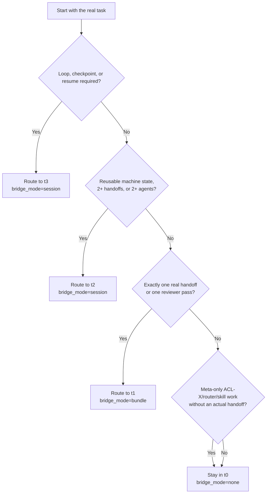

# Routing Decision Tree

ACL-X routing is driven by runtime structure first, not by ACL-X vocabulary alone.

## Concrete Signals

### Route To `t0`

- read-only extraction or summary
- strict output shape with no real delegation
- ACL-X, router, skill, or protocol documentation work that does not actually hand off or resume anything

### Route To `t1`

- `delegate once`
- `one reviewer pass`
- one child agent
- one compact handoff contract

### Route To `t2`

- shared artifact for the next phase
- reusable machine state across steps
- implement-then-review
- multiple subagents or parallel lanes without a loop

### Route To `t3`

- checkpoint and resume
- repeat until clean
- generator/critic/refiner loop
- replay or multi-round continuation

## Override Rules

Current supported overrides:

- Force style with `aclx supervisor --style adaptive|full`.
- Force profile with `aclx hybrid-prompt --profile review|implement|benchmark|debug|research`.
- Force task shape in Python with `ACLXSupervisor.build_payload(..., task_shape="delegated_once"|"shared_state"|"loop")`.
- Supply hard runtime facts in Python with `expected_handoffs`, `expected_rounds`, `child_agents`, and `shared_state=True`.
- Force a specific tier in the prompt builder with `HybridTaskSpec(tier="t1"|"t2"|"t3")`.

## Guardrails

- Start from `t0` and promote only from real runtime facts.
- Do not promote just because a task talks about ACL-X or subagents as subject matter.
- `t2` and `t3` need explicit outputs and constraints. Without them, the supervisor falls back to `t0`.
- `style="full"` is for debug-heavy investigation and should not replace the adaptive release default.
